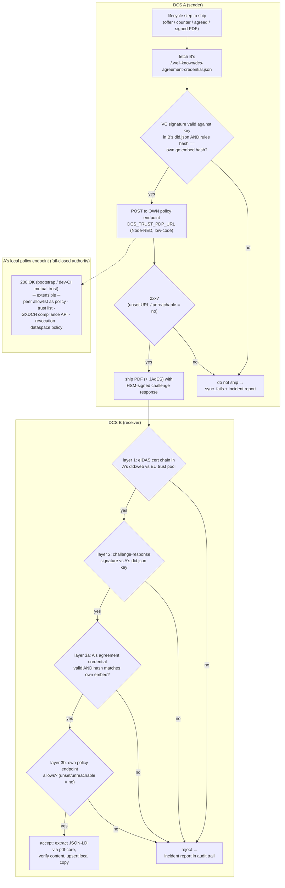

# ADR-19: Federation trust is layered — identity (eIDAS/did:web), rule acceptance (agreement credential), and a local policy endpoint

## Status

Accepted (2026-07-22). **Replaces the third trust layer of
[ADR-13](adr-13-pdf-exchange-federation.md)** (the static `trusted_peers`
allowlist, which is removed entirely) without touching the first two (eIDAS
certificate chain, per-request challenge-response). Research basis: Gaia-X Trust Framework / Compliance
Document (Loire), XFSC TSA/TRAIN specifications, EDC Decentralized Claims
Protocol, W3C VC Data Model 2.0 §5.5, Regulation (EU) 2024/1183.

## Context

Before any cross-instance interaction, two distinct questions must be
answered:

1. **Identity** — is the counterparty who it claims to be?
2. **Rule acceptance** — has the counterparty subjected itself to the rules
   of the federation (i.e. of this software)?

The existing federation stack answers only the first: the eIDAS certificate
chain in the peer's `did:web` document (verified against the EU trust pool),
the HSM-signed challenge-response per request, and a static local
`trusted_peers` table. The static table conflates authorization with
configuration: it cannot express *why* a peer is trusted, and every
dataspace-specific rule would grow another table. Nothing proves the peer
has *accepted the rules* under
which contracts are negotiated and signed — most concretely, nothing asserts
that the peer's designated signatories may legally represent the operating
party (neither an AES/QES nor an instance certificate carries power of
representation).

The surveyed ecosystems agree on two constraints:

- **Self-signed credentials are the entry point of a trust chain, never its
  anchor.** Gaia-X mandates a self-signed terms-and-conditions credential
  from every issuer, but conformance exists only once an external anchor
  (clearing house / trust list) countersigns. EDC/Catena-X reject self-signed
  membership credentials outright.
- **Policy checks are local — no "phone home".** EDC evaluates policies in
  the verifier's own engine on every DSP request; DCP and W3C VC both avoid
  per-interaction callbacks to third parties or to the counterparty for
  privacy reasons.

## Decision

**The third trust layer becomes: agreement credential AND the local policy
endpoint. The static `trusted_peers` allowlist is removed entirely** — its
job (deciding which peers this instance interacts with) moves into the
policy endpoint, where it is expressible as an actual policy instead of a
table row. The gate is **fail-closed**: without a configured
`DCS_TRUST_PDP_URL`, federation is disabled — nothing ships, nothing is
accepted. Dev and CI therefore run their mutual trust *through* the policy
endpoint (a Node-RED flow or test stub), keeping the trust root local while
the verification path is the production path (pattern shared by XFSC
Federated Catalogue, TRAIN, and EDC MVD: verification stays on, the trust
*root* is local).

1. **Every instance publishes a self-signed agreement credential** at
   `/.well-known/dcs-agreement-credential.json`, next to its `did.json`. It
   is a W3C Verifiable Credential (issuer = the instance's DID, signed with
   the instance's HSM-held VC key) whose `termsOfUse` (type
   `TrustFrameworkPolicy`) references the federation rules by URL and hash.
   The rules document itself is compiled into the binary via `go:embed`; the
   expected hash is computed from it at startup. Rule acceptance is therefore
   bound to the software version — no configurable drift, two instances of
   the same version agree automatically, tampered rules fail the hash
   comparison. An example rule, closing the power-of-representation gap:

   > "The federator of the DCS agrees that users operating the system that
   > are designated signatories are legally allowed to represent the
   > operating party."

2. **Both directions verify the peer's agreement credential.** Outbound,
   before shipping; inbound, in the `PostPdf` sequence after the eIDAS chain
   and challenge verification. Verification = fetch the peer's credential,
   check its signature against the key in the peer's `did.json`, compare its
   rules hash against the locally embedded expectation. A peer without a
   valid, matching credential is untrusted — the interaction is denied.

3. **The local low-code policy endpoint is the peer-authorization
   authority.** The trust gate POSTs
   `{peerDID, agreementCredential, direction, contractDID, targetState}` to
   `DCS_TRUST_PDP_URL`; 2xx allows, anything else — including an
   unconfigured URL or an unreachable endpoint — denies and raises an
   incident in the audit trail (fail-closed). Each instance consults only
   *its own* endpoint — the counterparty never calls it (the EDC/DCP "no
   phone home" constraint). The default deployment ships a Node-RED flow
   answering `200 OK`; operators replace or extend it with
   dataspace-specific checks (peer allowlists as policy, trust lists, a
   Gaia-X Clearing House via the GXDCH compliance API) as backend lookups of
   their own endpoint.

4. **The `trusted_peers` table, its `DCS_TRUSTED_PEERS` seeding, and
   `CheckForUntrustedPeers` are removed** — deleted, not wrapped. A dev/CI
   deployment that needs "these two instances trust each other" expresses it
   in the policy endpoint it already has to configure.

## The trust gate

The four resulting layers, and what anchors each:

| Layer | Question | Mechanism | Anchor |
| --- | --- | --- | --- |
| 1. Identity | Who are you? | `did:web` + eIDAS chain (`x5c`), challenge-response per request | EU trusted lists / QTSP |
| 2. Rule acceptance | Do you play by the rules? | Self-signed agreement credential, rules embedded via `go:embed` | Layer 1's key + federation accountability |
| 3. Policy | May *this* interaction happen? | Own low-code policy endpoint (fail-closed, sole peer-authorization authority); bootstrap `200 OK`, extensible to peer policies / trust lists / GXDCH | Whatever the endpoint consults |
| 4. Legal effect | Does the contract bind? | AES/QES on the document (PAdES/JAdES, DSS-validated) | eIDAS Art. 25/26 |

## Consequences

- The self-signed credential inherits its identity assurance from layer 1
  (the same HSM-backed DID key the eIDAS chain vouches for) — it adds the
  rule-acceptance dimension, it does not replace identity verification.
  Declaring it the anchor itself would be circular trust; the anchor is
  whatever the policy endpoint consults.
- Rule changes are software releases: editing the embedded rules document
  changes the hash, so mixed-version federations fail the agreement check
  loudly instead of drifting silently. This is intentional — the federation
  contract is versioned with the code.
- The gate is fail-closed with a single authorization authority: a
  misconfigured or unreachable policy endpoint denies federation loudly
  (incident in the audit trail) instead of silently falling back to a weaker
  check. There is no second code path to reason about.
- Dev/CI run the production verification path: both dev instances embed the
  same rules (same build → same hash), and their mutual trust is expressed
  in the policy endpoint they configure — the Node-RED `200 OK` flow in the
  compose/Helm stacks, a local stub in BDD scenarios (or a locally deployed
  gx-compliance container with `production=false`, analogous to the SoftHSM2
  pattern of [ADR-1](adr-1-key-custody.md)). The `trusted_peers` table, its
  migration, `DCS_TRUSTED_PEERS`, and `CheckForUntrustedPeers` are gone.
- A future upgrade of the agreement credential to a qualified electronic
  attestation of attributes (Regulation (EU) 2024/1183, Annex V) is a
  replacement, not an upgrade in place: a QEAA is by definition signed by a
  qualified trust service provider, ending the self-signed model for that
  artifact.
- Denied interactions are auditable: every trust-gate rejection lands in the
  audit trail via the incident-report flow
  ([ADR-16](adr-16-audit-checkpoints-external-anchoring.md) anchoring
  applies).

## Implementation state (verified shipped 2026-07-30)

Every row below was "pending" as of 2026-07-22 and has since shipped. The table
is kept only so the earlier revision is not mistaken for current scope.

| Piece | State |
| --- | --- |
| ADR + design, research run-down | this document |
| Embedded rules document (`go:embed`) + startup hash | shipped — `backend/internal/base/federation/credential.go`, checked in `dcstodcs/trustgate.go` |
| `/.well-known/dcs-agreement-credential.json` endpoint (Goa design + HSM-signed VC) | shipped — `gen/http/did_service/server/server.go`, consumed in `dcstodcs/trustgate.go` |
| Agreement verification in `PostPdf` and in the outbound ship path | shipped — `dcstodcs/trustgate.go` |
| `DCS_TRUST_PDP_URL` gate (fail-closed) + incident report on denial | shipped — `dcstodcs/trustgate.go` |
| Removal of `trusted_peers` table/migration, `DCS_TRUSTED_PEERS`, `CheckForUntrustedPeers` | shipped — `migrations/sql/20260722_drop_trusted_peers.sql` |
| Node-RED default flow (`200 OK`) wired into dev/CI stacks + documented GXDCH example flow | shipped |
| BDD scenarios in `features/17_peer_trust` (missing/invalid credential, denying policy stub, unset URL denies) | shipped — `features/17_peer_trust/two_instance_peer_trust.feature` |

## Note on the "ADR-19 ACn" citations

Eleven sites cite this ADR for numbered acceptance criteria — `trustgate.go`
(AC10, three sites), `synchronizer.go` (AC10),
`querytrustgatedenial.go` (AC10), and seven in
`steps/peer_trust/dcs_peer_trust_steps.py` (AC4–AC11).

**This document contains no numbered acceptance criteria, and no revision of it
ever did** (verified across its full history, and across all 32 ADRs in the
repo — none of them uses `ACn` numbering). The citations are misattributed:
this ADR is not their authority and cannot be read as defining them.

The numbering is real, though, and it is not this ADR's. It originates in the
`@REQ-fed-agreement-ACn` tags on the scenarios of
`features/17_peer_trust/two_instance_peer_trust.feature`, where each number
resolves to a named, executing scenario — AC4 "PostPdf rejects a peer that
publishes no agreement credential at all", AC10 "An unreachable policy endpoint
fails closed with exactly one incident and no retry", AC11 "Mutual trust between
instances runs through the default Node-RED policy flow", and so on. Every
citation checked resolves consistently against those tags. **A reader chasing an
`ACn` should read that feature file, not this document.**

No criteria have been added here to make the citations resolve: writing them now
would manufacture an authority after the fact and claim this ADR said something
it never said. The behaviours are real, specified by the scenarios, and tested;
only the attribution is wrong.
